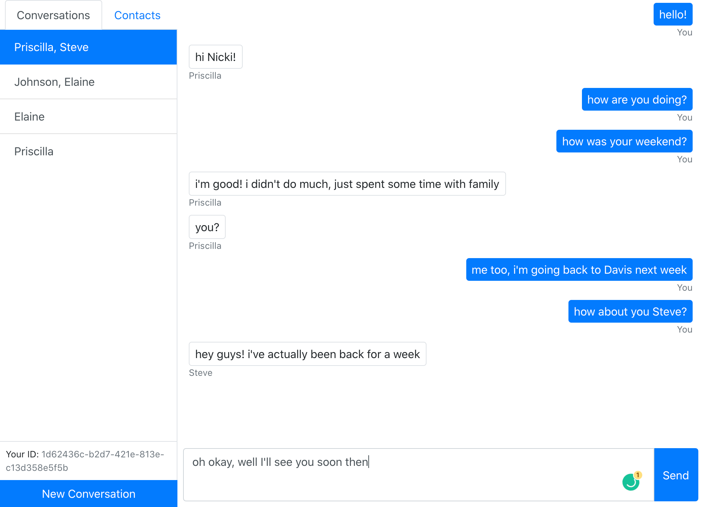

# Chat App

This is a simple chat web application created using Socket.io and React. It allows a user to sign in and communicate with others remotely using unique ID codes. Users can save contacts and create any combination of group chats with said people. Interface displays messages according to sender and recipients.

To test this, open the application in a normal tab AND an incognito tab. Copy the ID from each to create contacts. A conversation can then be exchanged between the two tabs.

This application was created with the help of <a href='https://github.com/WebDevSimplified'>WebDevSimplified</a>

## Screenshots

   
## Deployed Application
* <a href='https://chat-app-wds.herokuapp.com/'>Chat App</a>

## Technologies
* HTML
* CSS
* Javascript
* Node.js
* Express
* React
* React-dom
* Socket.io
* UUID
* CORS
* Bootstrap
* Heroku
  
## Portfolio
<a href="https://kdoh52.github.io/" target="_blank">Updated portfolio</a>

## Contact
* kdoh52@gmail.com
